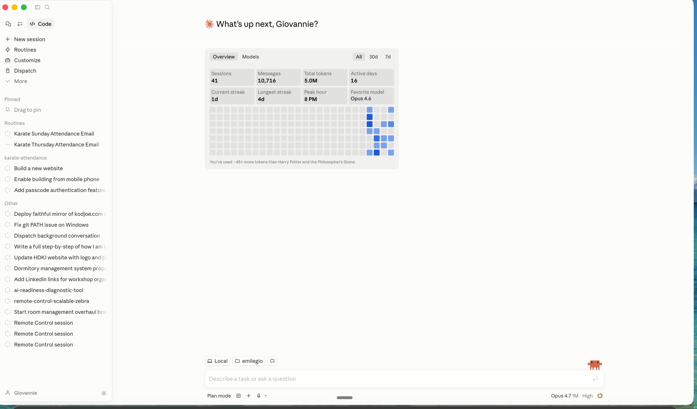

# Construire votre site web avec Claude

**Le guide officiel du KodjoLive, par Emile Zounon.**

Version PDF disponible a : emilezounon.com/KodjoLive

Vous avez assiste a la demo. Voici le guide complet pour le refaire vous-meme, chez vous, a votre rythme. Deux chemins, au choix selon votre niveau. Le resultat : un vrai site web en ligne que vous pouvez partager aujourd'hui.

---

## Choisissez votre chemin

| | Option 1 : Claude (app mobile / web) | Option 2 : Claude pour ordinateur (mode Code) |
|---|---|---|
| Pour qui | Tous, meme debutants | Ceux qui veulent aller plus loin |
| Plateforme | claude.ai ou app iOS / Android | App Claude pour Mac ou Windows |
| Pre-requis | Un compte gratuit | Un compte Claude, c'est tout |
| Temps | 15 a 30 minutes | 20 a 40 minutes |
| Resultat | Un fichier HTML | Un projet complet pret a deployer |

Les deux construisent le meme type de site. La difference, c'est l'outil.

---

# OPTION 1 : Construire avec Claude (l'application)

## Etape 1. Installer et ouvrir Claude

**Sur telephone :** cherchez Claude (icone orange, editeur Anthropic) sur l'App Store ou Google Play. Telechargez et creez un compte gratuit.

**Sur ordinateur :** allez sur claude.ai et connectez-vous.

## Etape 2. Commencer par un PLAN (regle d'or)

Ne demandez PAS a Claude de coder tout de suite. Ouvrez une nouvelle conversation et collez ce prompt :

```
Je veux construire un site web d'une seule page pour [DECRIVEZ VOTRE PROJET EN 2 PHRASES].
Public cible : [QUI S'EN SERT].
Objectif : [CE QUE VOUS VOULEZ QU'ILS FASSENT].

Avant d'ecrire le moindre code, propose-moi un PLAN detaille :
1. La liste des sections dans l'ordre
2. Le message principal de chaque section
3. La palette de couleurs suggeree
4. La typographie suggeree
5. Les elements interactifs prevus

Ne commence PAS a coder. Attends ma validation du plan.
```

**Exemple rempli :** Je veux construire un site web pour mon programme de coaching en nutrition en ligne. Public cible : femmes francophones de 30 a 50 ans. Objectif : qu'elles reservent un appel decouverte gratuit.

## Etape 3. Valider ou corriger le plan

Avant de laisser Claude coder, verifiez :

- [ ] Les sections sont dans le bon ordre pour convaincre
- [ ] Le message principal est clair
- [ ] La palette et la typographie correspondent a ma marque

**Si oui, dites :** *"Parfait. Construis maintenant le site complet en un seul fichier HTML avec tout inline (CSS et JavaScript). Affiche-le comme artefact."*

**Si non :** *"Retire la section FAQ. Ajoute des temoignages avant les tarifs. Change la palette en bleu et blanc."*

## Etape 4. Laisser Claude construire

Sur ordinateur : le site apparait dans le panneau de droite. Sur telephone : tapez sur la carte de l'artefact pour l'apercu plein ecran. Attendez la fin de la generation.

## Etape 5. Valider le site (checklist)

**Contenu**
- [ ] Titre principal clair et accrocheur
- [ ] Chaque section a un but evident
- [ ] Aucun texte "Lorem ipsum" oublie
- [ ] Prix et informations exactes

**Design**
- [ ] Couleurs correspondent a ma marque
- [ ] Texte lisible, bon contraste
- [ ] Images et icones s'affichent
- [ ] Espacement aere

**Mobile**
- [ ] Tout est lisible sur un ecran de telephone
- [ ] Boutons assez grands pour le doigt
- [ ] Aucune image ne deborde
- [ ] Menu hamburger fonctionne

## Etape 6. Iterer, un changement a la fois

```
Sur mobile, le titre deborde de l'ecran. Corrige uniquement ce point.
Le bouton "Commencer" est trop petit sur telephone. Rends-le plus grand.
Ajoute une section temoignages entre la methode et les tarifs.
Change la palette pour du vert foret et du beige.
```

## Etape 7. Sauvegarder le code

Sur l'artefact, cliquez sur **Copy** ou **Download**. Collez dans un fichier nomme `index.html`. Double-cliquez : le site s'ouvre dans votre navigateur sans internet.

**Pret a le mettre en ligne ? Passez a la section "Publier votre site" en bas.**

---

# OPTION 2 : Construire avec l'application Claude pour ordinateur (mode Code)

L'application Claude pour Mac et Windows a un mode **Code**. C'est comme un chat classique, mais Claude cree et modifie des fichiers directement sur votre ordinateur, dans un dossier que vous choisissez. Le **Plan Mode** est integre, activable en un clic. Aucun terminal, aucune ligne de commande.



*L'application Claude pour ordinateur en mode Code. Notez le bouton "Plan mode" en bas a gauche, et le selecteur de dossier (Local / emilegio) au-dessus du champ de saisie.*

## Etape 1. Installer l'application Claude

1. **Telecharger l'app** : allez sur claude.ai/download. Choisissez votre systeme (Mac ou Windows). Installez comme n'importe quelle application.
2. **Se connecter** : ouvrez l'application, connectez-vous avec votre compte Claude.
3. **Activer le mode Code** : en haut a gauche, cliquez sur l'onglet **Code** (icone </>).

## Etape 2. Creer un dossier pour votre projet

1. Sur votre ordinateur, creez un dossier nomme `monsite` (Finder sur Mac, Explorateur sur Windows). Bureau ou Documents, au choix.
2. Dans l'app Claude, au-dessus de la zone de saisie, cliquez sur **Local** puis l'icone dossier. Choisissez votre dossier. Claude travaillera desormais dedans.

## Etape 3. Activer le PLAN MODE

Plan Mode force Claude a reflechir et proposer un plan AVANT de toucher le moindre fichier.

1. **En bas a gauche**, cliquez sur **Plan mode**. Le libelle passe en actif.
2. Dans la barre laterale, cliquez sur **New session** pour commencer proprement.

## Etape 4. Decrire votre projet

Collez ce prompt dans le champ *"Describe a task or ask a question"* :

```
Je veux construire un site web statique d'une seule page pour [PROJET].
Public cible : [CIBLE]. Objectif : [ACTION].

Structure du projet : index.html, styles.css, script.js, dossier images/.
Pas de frameworks, pas de build. Le site doit s'ouvrir en double-cliquant index.html.

Propose-moi un plan complet :
- Arborescence des fichiers
- Sections dans l'ordre avec leur message
- Palette de couleurs et typographie
- Elements interactifs (menu mobile, FAQ, scroll, hover)
- Strategie de responsive design
- Comment on va valider a la fin

N'ecris aucun code tant que je n'ai pas valide le plan.
```

## Etape 5. Valider le plan

Claude propose un plan. Lisez-le. Demandez des ajustements si necessaire. Quand c'est bon, **desactivez Plan mode** (meme bouton en bas a gauche), puis dites :

*"Parfait, le plan me va. Construis le site maintenant dans mon dossier monsite."*

## Etape 6. Laisser Claude construire

Claude cree `index.html`, `styles.css`, `script.js` directement dans votre dossier. Vous voyez les fichiers apparaitre en direct dans Finder / Explorateur.

## Etape 7. Valider le site

Double-cliquez sur `index.html` : le site s'ouvre dans votre navigateur. Passez en revue la checklist de l'Option 1 (contenu, design, mobile).

Pour une auto-validation, demandez a Claude :

```
Fais une auto-validation du site : verifie que le HTML est valide,
que tous les liens fonctionnent, que le CSS n'a pas d'erreurs,
que le site est bien responsive.
Liste chaque probleme trouve avec la ligne exacte a corriger.
```

## Etape 8. Iterer avec Plan Mode pour les gros changements

- **Petit ajustement** : demandez directement ("change la couleur du bouton en or").
- **Changement structurel** : reactivez Plan mode, faites proposer un plan, validez, desactivez, laissez executer.

## Etape 9. Pret a publier ?

Passez a la section "Publier votre site" en bas. L'app Claude peut vous guider :

```
Guide-moi etape par etape, avec les boutons exacts a cliquer, pour :
1. Creer un compte GitHub si je n'en ai pas
2. Creer un nouveau depot public nomme mon-site
3. Uploader mon fichier index.html
4. Activer GitHub Pages dans les parametres
5. Trouver et copier mon URL publique finale

Je suis debutant total, je n'ai jamais utilise GitHub. Sois tres precis.
```

---

# PUBLIER VOTRE SITE SUR GITHUB PAGES

Gratuit, pour toujours, sans carte bancaire, sans limite. Tout se passe dans le navigateur.

## Etape 1. Creer un compte GitHub (si vous n'en avez pas)

Allez sur github.com/signup. Creez un compte avec votre email. Choisissez un nom d'utilisateur court et professionnel, il apparaitra dans votre URL publique.

## Etape 2. Creer un nouveau depot (repository)

1. Allez sur **github.com/new**.
2. **Nom du depot** : `mon-site` (court, sans espace).
3. Cochez **Public** (obligatoire pour GitHub Pages gratuit).
4. Cochez **Add a README file**.
5. Cliquez **Create repository**.

## Etape 3. Ajouter votre fichier HTML

1. Sur la page du depot, cliquez **Add file** (en haut a droite) → **Upload files**.
2. Glissez-deposez votre fichier. **Il DOIT s'appeler `index.html`** (minuscules, sans accent). Renommez-le avant si necessaire.
3. Descendez en bas de page, cliquez **Commit changes**.

> **Si vous avez deja uploade un fichier avec un mauvais nom** : cliquez dessus, puis sur l'icone crayon, renommez en `index.html`, validez.

## Etape 4. Activer GitHub Pages

1. Dans votre depot, cliquez sur l'onglet **Settings** (tout en haut a droite, a cote d'Insights).
2. Dans le menu de gauche, cliquez sur **Pages**.
3. Sous *"Build and deployment" → "Source"*, laissez **Deploy from a branch**.
4. Sous *"Branch"*, selectionnez **main** et le dossier **/ (root)**.
5. Cliquez **Save**.

## Etape 5. Trouver votre lien public (le moment magique)

1. **Attendre 60 a 90 secondes.** GitHub construit votre site.
2. **Rafraichir** la page Settings → Pages.
3. Un **encadre vert** apparait en haut avec le message : *"Your site is live at..."* suivi de votre URL.
4. Le lien ressemble a : `https://VOTRE-NOM.github.io/mon-site/`
5. Cliquez sur le lien pour tester, puis sur l'icone **copier** pour le partager partout.

> **Astuce visuelle :** vous pouvez aussi voir votre lien sur la page d'accueil du depot. Regardez a droite, sous *"About"*, GitHub affiche un lien globe 🌐 vers votre site une fois Pages active.

## Etape 6. Modifier votre site plus tard

Pas besoin de refaire toutes les etapes. Pour chaque mise a jour :

1. Dans votre depot, cliquez sur `index.html`.
2. Cliquez sur l'icone **crayon** pour editer, OU supprimez et uploadez une nouvelle version.
3. Validez (Commit changes). GitHub redeploie automatiquement en 30 secondes. Rafraichissez votre URL publique.

## Bonus pro : domaine personnalise

Connectez un nom de domaine comme `monsite.com` gratuitement via *Settings → Pages → Custom domain*. Votre registraire (OVH, GoDaddy, Namecheap) vous dira quoi pointer. Demandez a Claude : *"Guide-moi pour connecter mon domaine monsite.com a GitHub Pages."*

---

# LE PROMPT MAITRE A GARDER POUR TOUJOURS

Copiez-le dans vos notes. Changez les crochets. Reutilisez-le pour chaque nouveau projet.

```
Je veux construire un site web d'une page pour [PROJET].
Public : [CIBLE].
Objectif : [ACTION SOUHAITEE].

ETAPE 1 : Propose-moi un plan detaille (sections, messages, palette, typographie).
Ne code rien avant ma validation.

ETAPE 2 : Apres validation, construis le site complet.
- Option Claude (app mobile / web) : UN SEUL fichier HTML, tout inline, Google Fonts autorise, affiche en artefact.
- Option Claude pour ordinateur (mode Code) : structure propre (index.html, styles.css, script.js) dans mon dossier local.

ETAPE 3 : Assure-toi que le site est parfaitement responsive et utilisable sur telephone
(boutons minimum 44px, texte lisible, pas de debordement).

ETAPE 4 : Fais une auto-validation : liste les points OK et les points a corriger.

Pas de tirets cadratins (— ou –). Utilise virgules, points ou deux-points.
```

---

# LES 3 REGLES D'OR

1. **Planifier avant de coder.** Toujours. Un bon plan evite trois mauvais builds.
2. **Un changement a la fois.** Dire "change tout" donne du chaos. Dire "change la couleur du bouton" donne un resultat precis.
3. **Tester sur telephone.** La moitie de vos visiteurs seront sur mobile. Si ca ne marche pas sur telephone, ca ne marche pas.

---

**KodjoLive x Emile Zounon.** Construit en direct. Partage avec amour.

Ressources :
- Guide en ligne : emilezounon.com/KodjoLive
- Claude : claude.ai
- Claude pour ordinateur : claude.ai/download
- GitHub : github.com
